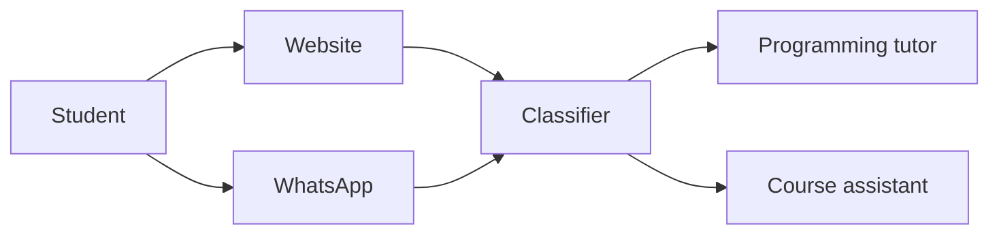
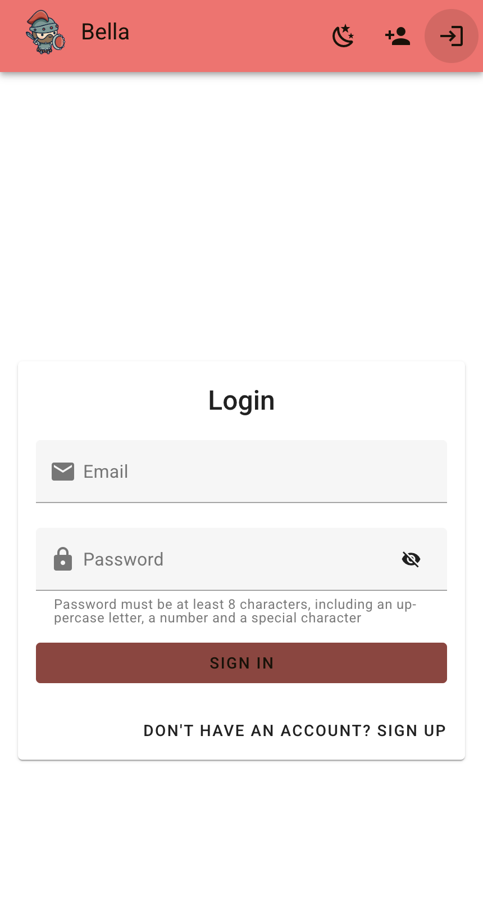
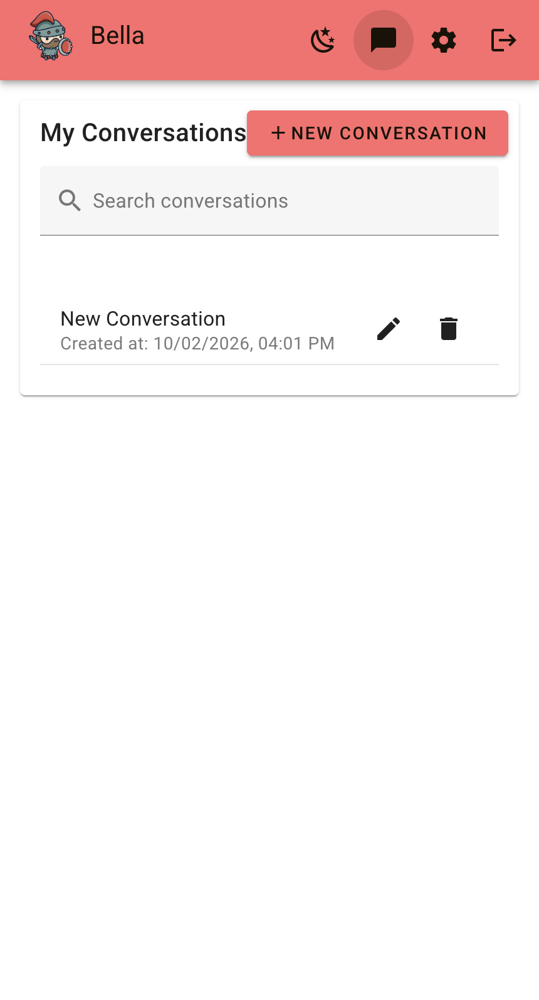
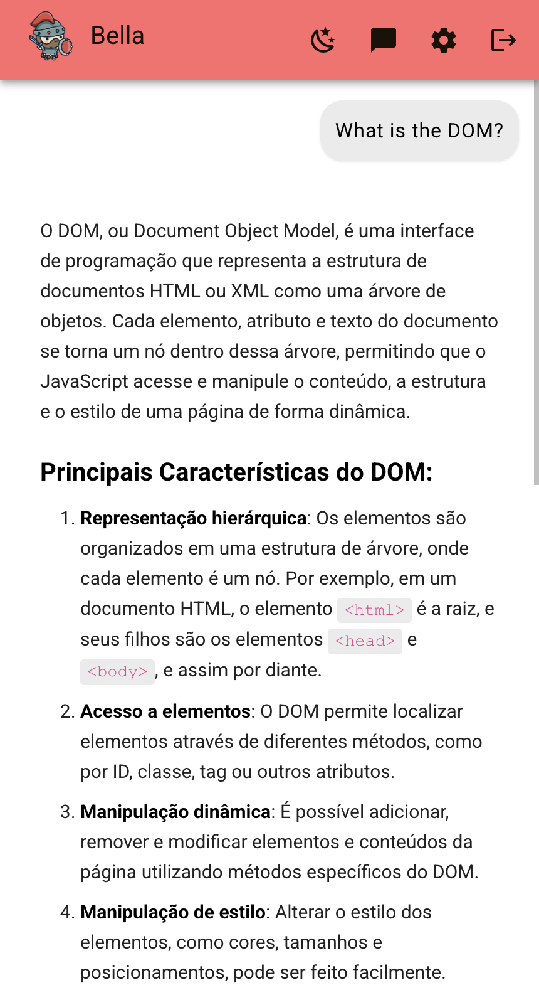

# Bella

Bella supports programming classes. She is the virtual tutor for Construção de Páginas Web II, in the Sistemas para Internet program at IFRS, Porto Alegre campus.

## Purpose

Bella is a study chatbot that helps students learn programming and find their way through the program. She helps them understand the material, not skip it, and she gives reliable answers about how the program works.

**Learning without shortcuts.** While studying, students can ask Bella to explain a concept, find the cause of an error, or suggest practice. For graded work, she guides the reasoning but never hands over a finished solution, so the learning stays with the student.

**Answers they can trust.** In the same conversation, students can ask about dates, workload, and rules. These answers come only from official program documents, so students don't have to guess or rely on word of mouth.

## How it works

Students talk to Bella on the website or on WhatsApp. A classifier reads each message and routes it to the right assistant:

- **Tutor:** programming questions on JavaScript, the DOM, Vue, HTTP, Node, and exercises. She explains the idea and helps the student reason through it, but does not complete assignments.
- **Document assistant:** questions about the pedagogical project, the curriculum, the academic calendar, and the rules. It answers only from official documents.



The website is a Vue 3 app with Vuetify. Sign in uses [Orion Users](https://github.com/orion-services/users), with email and password, Google, and two factor authentication. The server is Quarkus.

<p align="center">
  
  
  
</p>

## Documents

Bella accepts three kinds of documents: plain text (for example Markdown), PDF files, and URLs. Text files and PDFs are read from the folder in `rag.location`. URLs are listed in `rag.scrape.urls` and converted to Markdown. On startup, Bella indexes all of them and stores the chunks in two separate corpora. Each message is searched in one corpus only. Programming questions use the discipline pages. Questions about the program use the institutional documents.

Both lists live in [application.properties](src/main/resources/application.properties).

### Program corpus

The program corpus currently holds one local file, [ppc-sistemas-para-internet.md](src/main/resources/rag/ppc-sistemas-para-internet.md). It is the pedagogical project of the Sistemas para Internet technology program at IFRS, Porto Alegre campus, dated December 2025. The folder does not yet include an academic calendar or any other institutional document.

### Discipline corpus

The discipline corpus is scraped from [cpw2.rpmhub.dev](https://cpw2.rpmhub.dev) and stored as Markdown:

- [Introdução](https://cpw2.rpmhub.dev/introducao/introducao.html)
- [Variáveis](https://cpw2.rpmhub.dev/variaveis/variaveis.html)
- [Tipos](https://cpw2.rpmhub.dev/tipos/tipos.html)
- [Operadores](https://cpw2.rpmhub.dev/operadores/operadores.html)
- [Estruturas de controle](https://cpw2.rpmhub.dev/controle/controle.html)
- [Funções](https://cpw2.rpmhub.dev/funcoes/funcoes.html)
- [DOM](https://cpw2.rpmhub.dev/dom/dom.html)
- [AJAX](https://cpw2.rpmhub.dev/ajax/ajax.html)
- [Simulados](https://cpw2.rpmhub.dev/exercicios/simulados.html)

## Running locally

You need Java 25, Docker, and an OpenAI API key. Docker starts Orion Users and the databases Bella uses in development.

1. Clone this repository.
2. Copy `.env.example` to `.env`. Set `POSTGRES_PASSWORD` and `OPENAI_API_KEY`. For local email confirmation, set `ORION_USERS_EMAIL_VALIDATION_URL` to `http://localhost:8082/users/validateEmail`.
3. Copy `frontend/.env.example` to `frontend/.env`. The example already points Orion Users at `http://localhost:8082`.
4. Start the application.

```shell
./mvnw quarkus:dev
```

The first start builds Orion Users and can take several minutes. Later starts reuse that image when `main` has not changed. Open <http://localhost:8080>. Quarkus builds the Vue app on startup and serves it. You do not need a separate `npm run dev` for normal use.

Development uses the same OpenAI models as production. Chat uses `gpt-4o-mini`. Embeddings use `text-embedding-3-small`. If a local Postgres database still has an embeddings table from the previous 384 dimension model, drop that table once. Startup can then recreate it at 1536 dimensions.

The Vue build runs once, when `./mvnw quarkus:dev` starts. If you edit anything under `frontend/src` while development mode is already running, stop it and start it again. Live reload watches `src/main/java` and `src/main/resources` only.

If you want instant reload while you work on Vue components, run this in `frontend`:

```shell
npm run dev
```

Vite then serves the interface at <http://localhost:5173> and proxies API calls to port 8080. That server is only a convenience for frontend work.

The test profile does not start Orion Users. Tests keep a local Ollama model for chat.

In development mode, the Quarkus Dev UI is at <http://localhost:8080/q/dev/>.

### Package a jar

```shell
./mvnw package
```

Run the result with `java -jar target/quarkus-app/quarkus-run.jar`. Dependencies are copied into `target/quarkus-app/lib/`. This is not an uber jar.

### Native executable

With GraalVM installed:

```shell
./mvnw package -Dnative
```

Without GraalVM, build inside a container:

```shell
./mvnw package -Dnative -Dquarkus.native.container-build=true
```

Run it with `./target/bella-1.0.0-runner`.

Production runs on a single EC2 instance in São Paulo (`sa-east-1`). See [docs/aws.md](docs/aws.md).
